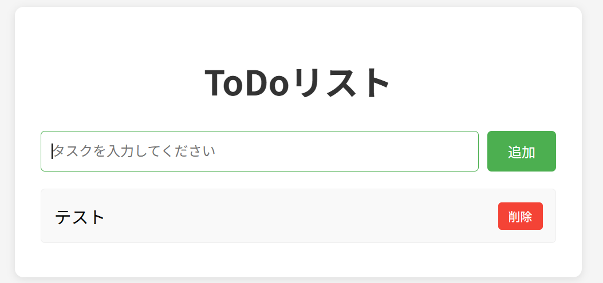

# Week 01: ToDoリストアプリ

## プロジェクト概要
シンプルなToDoリスト管理アプリケーションです。タスクの追加、完了、削除機能を実装し、Webアプリケーション開発の基礎を学習します。

## 完成イメージ


## 学習内容

### 技術スタック
- **HTML5**: セマンティックなマークアップ
- **CSS3**: レスポンシブデザイン、Flexbox
- **JavaScript (ES6+)**: DOM操作、イベント処理、ローカルストレージ

### 学んだこと
- 📝 HTML要素の構造化
- 🎨 CSSによるスタイリングとレイアウト
- ⚡ JavaScriptでの動的なDOM操作
- 💾 ローカルストレージを使ったデータ永続化
- 🎯 イベントリスナーの実装
- ✨ ユーザーインタラクションの実装

## 機能一覧

### 実装済み機能
- ✅ タスクの追加
- ✅ タスクの完了/未完了の切り替え
- ✅ タスクの削除
- ✅ ローカルストレージへの保存
- ✅ ページリロード後もデータが保持される

## ファイル構成
```
week01-todo-app/
├── index.html          # メインHTMLファイル
├── style.css           # スタイルシート
├── script.js           # JavaScriptロジック
├── requirements.md     # 要件定義書
├── design.md           # 設計書
├── README.md           # このファイル
└── knowledge/          # 学習内容の記録
    ├── dom-basics.md   # DOM操作の基礎
    └── error-topic/    # エラー・小知識
        └── html-defer-aria-warnings.md
```

## セットアップ方法

### 前提条件
- モダンなWebブラウザ（Chrome, Firefox, Safari, Edge など）
- テキストエディタ（VSCode推奨）

### 実行方法
1. このディレクトリをローカルにクローン
2. `index.html` をブラウザで開く

```bash
# 方法1: ファイルを直接開く
open index.html  # macOS
start index.html # Windows
xdg-open index.html # Linux

# 方法2: ローカルサーバーを使用（推奨）
# Python 3の場合
python3 -m http.server 8000
# その後、ブラウザで http://localhost:8000 を開く
```

## 使い方

### タスクの追加
1. テキストボックスにタスク内容を入力
2. 「追加」ボタンをクリック、またはEnterキーを押す

### タスクの完了
- タスクをクリックすると完了/未完了が切り替わります
- 完了したタスクには取り消し線が表示されます

### タスクの削除
- 各タスクの「削除」ボタンをクリック

## コードの特徴

### HTML
- セマンティックな要素の使用
- アクセシビリティ属性（`aria-busy`）の設定
- `defer`属性によるスクリプトの最適化

### CSS
- Flexboxによるレイアウト
- ホバーエフェクト
- レスポンシブデザイン

### JavaScript
- モダンなES6+構文
- DOM APIの活用
- イベントリスナーによるユーザーインタラクション
- LocalStorage APIによるデータ永続化
- 詳細なコメント付き

## 学習ポイント

### 初心者が学べること
1. **HTML構造の理解**: 適切な要素の選択と配置
2. **CSSスタイリング**: 見た目を整える基本技術
3. **JavaScript基礎**: 変数、関数、イベント処理
4. **DOM操作**: 要素の取得、作成、追加、削除
5. **データ永続化**: ローカルストレージの使い方

### 次のステップ
このプロジェクトを完了したら、以下の拡張機能に挑戦してみましょう：
- [ ] タスクの編集機能
- [ ] カテゴリ分け機能
- [ ] 期限設定機能
- [ ] フィルター機能（全て/未完了/完了）
- [ ] ドラッグ&ドロップでの並び替え
- [ ] ダークモード対応

## トラブルシューティング

### タスクが保存されない
- ブラウザのローカルストレージが有効か確認
- プライベートブラウジングモードでは保存されません

### スタイルが適用されない
- `style.css`のパスが正しいか確認
- ブラウザのキャッシュをクリア

### JavaScriptが動作しない
- ブラウザの開発者ツール（F12）でエラーを確認
- `script.js`のパスが正しいか確認

## 参考資料
- [MDN Web Docs - JavaScript](https://developer.mozilla.org/ja/docs/Web/JavaScript)
- [MDN Web Docs - DOM](https://developer.mozilla.org/ja/docs/Web/API/Document_Object_Model)
- [MDN Web Docs - Web Storage API](https://developer.mozilla.org/ja/docs/Web/API/Web_Storage_API)

## ライセンス
このプロジェクトは学習目的で作成されています。自由に改変・再配布してください。
